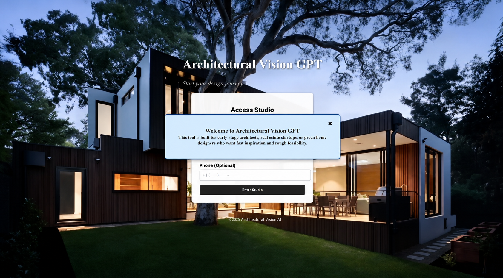

<div align="center">

# 🏠 Architectural Vision GPT

### AI-Powered Interior Design Recommendation System

An intelligent web application that provides AI-powered interior design consultation, room analysis, and realistic interior visualizations using **Google Gemini** and **DALL·E 3**.

<p>


</p>

</div>

---

# 📖 Overview

Architectural Vision GPT is an AI-powered Interior Design Recommendation System developed as a Software Engineering project. The application combines conversational AI, intelligent room analysis, and AI-generated visualizations to help users design beautiful and functional interior spaces.

Unlike traditional interior design tools, Architectural Vision GPT acts as a virtual interior designer by providing detailed recommendations based on user requirements, uploaded room images, budget, room dimensions, and preferred design style.

---

# ✨ Key Features

## 🤖 AI Interior Design Consultation

Receive personalized interior design recommendations by simply describing your room or design idea.

The AI provides:

- 🛋 Furniture recommendations
- 🎨 Color palette suggestions
- 🧱 Material recommendations
- 💰 Estimated project cost
- 💡 Lighting recommendations
- 🪵 Flooring suggestions
- 🏠 Space optimization
- 📐 Layout planning
- 🌿 Sustainability ideas
- 📈 Modern interior design trends

---

## 📷 AI Room Analysis

Upload a room image and let the AI analyze your existing space.

The system identifies:

- Room layout
- Furniture arrangement
- Empty spaces
- Design improvements
- Better furniture placement
- Interior enhancement suggestions
- Material recommendations

---

## 🎨 AI Interior Image Generation

Generate realistic interior concepts using **DALL·E 3**.

Simply describe your dream room and receive an AI-generated visualization.

Example prompts:

- Luxury Living Room
- Modern Kitchen
- Scandinavian Bedroom
- Backyard with Swimming Pool
- Minimalist Office

---

# 🛠 Technology Stack

| Category | Technology |
|------------|----------------|
| Frontend | React.js |
| Backend | Flask (Python) |
| AI Model | Google Gemini |
| Image Generation | DALL·E 3 |
| Version Control | Git & GitHub |

---

# 🏗 System Workflow

```text
User
   │
   ▼
React Frontend
   │
   ▼
Flask Backend
   │
   ├────────────► Google Gemini
   │                 │
   │                 ▼
   │     Interior Design Consultation
   │
   └────────────► DALL·E 3
                     │
                     ▼
         AI Generated Interior Design
```

---

# 📸 Application Screenshots

<table>

<tr>

<td align="center">

<b>Login Screen</b>

<br>



</td>

<td align="center">

<b>Text Consultation</b>

<br>


</td>

</tr>

<tr>

<td align="center">

<b>AI Image Generation</b>

<br>


</td>

<td align="center">

<b>Image Upload</b>

<br>


</td>

</tr>

<tr>

<td align="center">

<b>Room Analysis</b>

<br>


</td>

<td align="center">

<b>Welcome Screen</b>

<br>


</td>

</tr>

</table>

---

# 🚀 Installation

## Clone Repository

```bash
git clone https://github.com/Kinjalpanjwani/Architecture-GPT-.git
```

---

## Frontend

```bash
cd frontend
npm install
npm start
```

---

## Backend

```bash
cd backend
pip install -r requirements.txt
python app.py
```

---

# 💡 Example Use Cases

### Bedroom Design

**Prompt**

> Design my small bedroom with a modern aesthetic.

**AI Output**

- Furniture placement
- Color palette
- Lighting plan
- Material recommendations
- Estimated renovation cost

---

### Kitchen Analysis

Upload a kitchen image.

The AI analyzes:

- Existing layout
- Cabinet placement
- Countertop material
- Lighting
- Space utilization

---

### AI Visualization

Prompt:

> Generate a luxurious Scandinavian living room.

Output:

AI-generated interior concept image using DALL·E 3.

---

# 📂 Project Structure

```text
Architecture-GPT
│
├── frontend/
│
├── backend/
│
├── screenshots/
│   ├── pic1.png
│   ├── pic2.png
│   ├── pic3.png
│   ├── pic4.png
│   ├── pic5.png
│   └── pic6.png
│
├── README.md
│
└── LICENSE
```

---

# 🎯 Future Enhancements

- Voice-based AI assistant
- 3D room visualization
- Augmented Reality preview
- Save multiple projects
- Vendor recommendations
- Budget comparison
- Furniture marketplace integration

---

# 📚 Academic Information

**Course:** Software Engineering

**Project Title:** Architectural Vision GPT

**Project Type:** AI-Powered Interior Design Recommendation System

---

# 👨‍💻 Developer

**Kinjal Kashyapi Panjwani**

Student ID: **23108114**

GitHub:

https://github.com/Kinjalpanjwani

---

<div align="center">

### ⭐ If you found this project interesting, please consider giving it a Star!

Made with ❤️ using React, Flask, Google Gemini & DALL·E 3.

</div>
